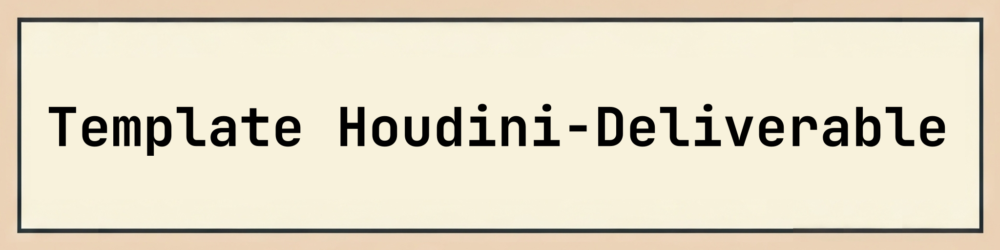

# Houdini-Deliverable-Template
Houdiniで開発したツール・パイプライン群の納品用標準テンプレート

# 概要

このリポジトリは、コンバートのためのシーンやhdaなどのツールセットを、開発した場合の納品形式を想定したテンプレートです。

リポジトリごとに添付されたpackagesファイルを設定することで環境パスなどを設定可能にする想定です。

# セットアップ

Houdini、Python、UnrealEngineなどで関連データを扱うために必要なセットアップを記載します

1.  **リポジトリのクローンまたはダウンロード:**

    任意の場所にクローンまたはダウンロードしてください。

2.  **Houdiniパッケージを環境に追加**
    
    $HOUDINI_PACKAGE_DIR パスが通るディレクトリに[パッケージファイル名.json]を配置してください。
    デフォルトでは以下のディレクトリにパスが設定されています

    * **Windows:** `[ユーザードキュメントディレクトリ]/houdiniX.X/packages`
    * **macOS:** `~/Library/Preferences/houdini/X.X/packages`
    * **Linux:** `~/houdiniX.X/packagesnv`

    `packages` ディレクトリが存在しない場合は作成してください。

# 使い方

セットアップ完了後、以下の手順でデータの作成が可能です。

1.  **sample.hipを開く**

2.  **geo/sample に対象ディレクトリのパスを設定**

# 各ディレクトリについて

ディレクトリ構造とそれぞれの役割は以下の通りです。

* `docs/`:README.md等で利用される関連ファイル
  * `/images/`: README.md等で利用される画像ファイル
* `geo/`:必要なジオメトリデータがあれば含める
* `hip/`:Houdini シーンファイルを格納
* `icons/`: ツール、シェルフ、メニューなどで使用するアイコン画像
* `otls/`:Houdini Digital Assets (.hda) を格納
* `scripts/`: パイプラインで実行されるPython等のスクリプト
  * `/python/`: Pythonモジュール
* `unity/`: unity関連ファイルがあれば格納する
* `unreal/`: unreal engine関連ファイルがあれば格納する
* `usd/`: USD関連ファイルがあれば格納する

# 管理者

このテンプレートに関するご質問、不具合の報告、または改善提案などがありましたら、以下の連絡先にご連絡ください。

* プロジェクトメンテナー: [Maneki Pipeline/ FishBall](https://www.procedural.jp/)
* お問い合わせ先: [Maneki Pipeline/ 連絡先](https://www.procedural.jp/articles/rsfyqf0k3hdc)

---